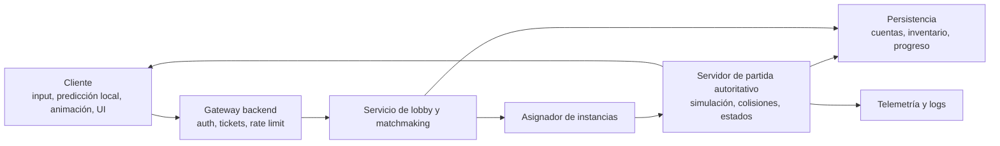
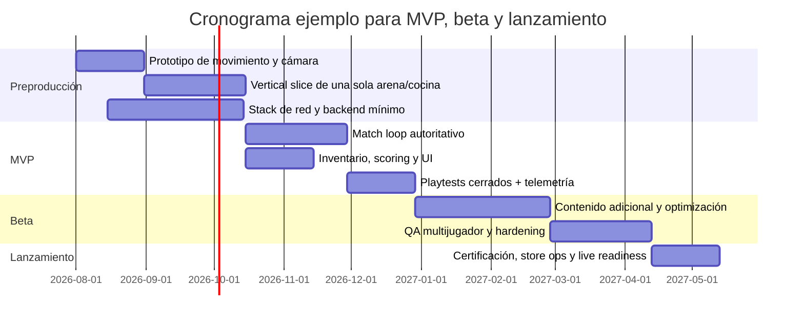

# Informe técnico para crear un party game con estilo Fall Guys u Overcooked

## Resumen ejecutivo

Para un juego con ADN de **party game físico y cooperativo**, la decisión que más condiciona riesgo, costo y tiempo no es el arte, sino la combinación entre **modelo de movimiento**, **topología de red** y **motor**. En la práctica, un clon espiritual de *Overcooked* es bastante más barato de sacar a un MVP jugable que uno de *Fall Guys*, porque tolera mejor un controlador de personaje kinemático, menos cuerpos físicos simultáneos, cámaras más simples y una replicación menos agresiva. Un juego tipo *Fall Guys* exige resolver mejor colisiones entre jugadores, empujes, recuperaciones, ragdoll o pseudo ragdoll, y una presentación de red más robusta para que el caos siga “leyéndose” como justo y divertido. Esta conclusión es una inferencia de las capacidades y limitaciones documentadas por los motores y stacks actuales, especialmente las diferencias entre controladores de personaje kinemáticos, física de rigidbodies, suavizado de red y predicción. citeturn4search0turn4search1turn27search0turn6search3

Si el objetivo es **un MVP online público, jugable y defendible**, la recomendación práctica es esta: **servidor autoritativo dedicado por partida**, inputs desde cliente, simulación autoritativa en servidor, **predicción local solo para el propio jugador**, **interpolación bufferizada para los demás**, persistencia mínima para cuenta, cosméticos y progreso, y lobby/matchmaking separados de la simulación de partida. Para party games con física expresiva, esto reduce trampas y simplifica depuración frente a P2P o autoridad distribuida. Los servicios y motores actuales encajan bien con esa forma de trabajo: Unity ofrece SDK unificado para Lobby, Matchmaker y Relay, aunque su Netcode for GameObjects no trae predicción/reconciliación completa; Unreal trae un stack más maduro para movimiento replicado y suavizado; Godot es viable con ENet/WebRTC y sincronización de autoridad, pero pide más ingeniería propia para una producción comercial online. citeturn8search1turn4search1turn4search22turn27search0turn27search12turn6search13turn0search2

Para un estudio pequeño o un equipo indie, hay tres rutas sensatas. La más rápida para un MVP es **Unity + Photon Fusion**. La más sólida para una carrera física 3D con ambición mediana o alta es **Unreal + dedicated servers + EOS/Steamworks**. La más barata en licencias pero más cara en ingeniería es **Godot + Colyseus o Nakama**. Unity sigue siendo una ruta muy productiva, pero hoy conviene asumir explícitamente sus límites en predicción completa y el cambio de su ecosistema multijugador tras la deprecación de Multiplay Hosting en marzo de 2026. Unreal, en cambio, ya trae piezas maduras para Character Movement, smoothing, Chaos Physics y testing automatizado. Godot permanece bajo licencia MIT y ofrece ENet, WebRTC, WebSocket y sincronización por autoridad, pero no reduce por sí solo el trabajo de backend y red de un juego live. citeturn3search2turn21search0turn21search11turn8search8turn1search1turn27search0turn5search5turn22search7turn22search2

Mi recomendación concreta para un **MVP jugable** es arrancar con un **Overcooked-like de 4 jugadores**, cámara compartida o top down, una única cocina, 8 a 12 acciones nucleares, colisiones simples, “ragdoll-lite” cosmético y autoridad total de servidor. Cuando ese bucle esté validado, se puede migrar parte del stack hacia pruebas de carrera física tipo *Fall Guys* manteniendo backend, telemetría, QA, despliegue y matchmaking casi sin cambios. Esa secuencia disminuye el riesgo técnico sin bloquear la dirección estética o comercial del proyecto.

## Diseño jugable y movimiento de personajes

Un juego “tipo *Fall Guys* u *Overcooked*” suele combinar tres capas: **locomoción legible**, **interacción física divertida** y **animación que exagera el feedback**. La diferencia técnica está en cuánto manda la simulación. En un clon espiritual de *Overcooked*, conviene que la locomoción la gobierne el código y no la física pura: aceleración, frenado, giro, agarre de objetos, empujes muy controlados. En un clon espiritual de *Fall Guys*, lo mejor suele ser un enfoque híbrido: locomoción principal estable y predecible, pero con impulsos, derribos, cuerpos blandos parciales y colisiones con obstáculos físicos que aporten caos medido. Los motores soportan estas piezas de maneras distintas: Unity distingue claramente entre `CharacterController` y `Rigidbody`; Unreal basa el movimiento jugable en `CharacterMovementComponent` y puede mezclar física con animación; Godot usa `CharacterBody3D` para cuerpos movidos por script, no por simulación física directa. citeturn4search0turn26search1turn27search12turn5search1turn6search3turn6search7

### Mecánicas clave e implementación técnica recomendada

| Área | Overcooked-like | Fall Guys-like | Implementación técnica recomendada |
|---|---|---|---|
| Movimiento base | Movimiento top down o 2.5D, alta respuesta | Movimiento 3D con saltos, pendientes, barridos laterales | Para co-op cocina, usa controlador kinemático o `CharacterBody` con aceleración y desaceleración en código. Para carrera física, usa cápsula jugable estable y desacopla la “física graciosa” del núcleo de locomoción. Unity `CharacterController` y Godot `CharacterBody3D` están hechos para movimiento controlado por script; Unreal `CharacterMovementComponent` soporta varios modos de movimiento. citeturn4search0turn4search6turn6search3turn27search12 |
| Aceleración y control | Curvas suaves, input digital o analógico | Input analógico, control aéreo limitado, asistencia de giro | Modela velocidad objetivo y aplica aceleración por frame o tick fijo. Evita depender de fuerzas reales para todo el cuerpo del jugador salvo en derribos. Es una recomendación de diseño basada en la separación entre movimiento controlado y física documentada en Unity, Unreal y Godot. citeturn4search0turn27search12turn6search18 |
| Colisiones con escenario | Prioridad a claridad y lectura | Prioridad a robustez con obstáculos móviles | Usa primitivas simples: cápsula para cuerpo, esfera o box para pies/manos si hace falta. En Unity conviene activar CCD en rigidbodies rápidos (`Continuous Dynamic`) y usar Physics Materials para fricción/rebote; en Unreal conviene mantener colisión simple en el actor jugable; en Godot usa capas y máscaras con `move_and_slide()`. citeturn26search1turn26search3turn26search11turn24search9turn6search7turn6search19 |
| Colisiones entre jugadores | Empuje sutil y predecible | Bloqueos, golpes, rebotes y crowding | Separa la colisión “de gameplay” de la colisión “visual”. Para MVP, el servidor resuelve penetraciones con prioridades sencillas y un máximo de empuje por tick. No hagas full rigidbody character-vs-character desde el día uno si buscas estabilidad online. |
| Interacción con objetos | Pickup, drop, throw, use | Carry, grab, empuje, trigger físico | Modela objetos interactivos con estado explícito server side: libre, tomado, lanzado, bloqueado. Los eventos de pickup y uso deben ser autoritativos y idempotentes. |
| Animación locomotora | Idle, run, carry, interact | Idle, run, jump, fall, stumble, recover | En Unity usa Animator + Blend Trees y, si hace falta, Animation Rigging para IK y ajustes; en Unreal usa Animation Blueprints y State Machines; en Godot usa `AnimationPlayer` + `AnimationTree`. citeturn26search2turn26search6turn25search7turn25search13turn6search2turn6search18 |
| Ragdoll o derribo | Opcional y breve | Altamente recomendable, pero híbrido | En Unity existe Ragdoll Wizard; en Unreal Chaos y Physics Assets permiten ragdoll y física basada en animación. Recomendación: úsalo como estado temporal de 0.3 a 1.0 s y vuelve a locomoción animada. El servidor debe autorizar el cambio de estado y la duración, aunque la simulación visual pueda maquillarse localmente. citeturn26search4turn5search1turn5search17turn5search25 |
| Interpolación y smoothing | Suavizado simple | Suavizado más corrección de errores | Para jugadores remotos, usa interpolación entre snapshots con buffer corto. Unreal documenta smoothing explícito en Character Movement; Godot ofrece interpolación física; Unity ofrece anticipation, no rollback completo nativo en NGO. citeturn27search0turn6search0turn4search1 |
| Impulsos y knockback | Diseño fuerte, física débil | Diseño fuerte, física moderada | Trata el impulso como evento de gameplay: vector, magnitud, duración de stun, ventana de invulnerabilidad. No dejes que el cliente decida el resultado final. |

### Cómo implementarlo de forma robusta

Para un MVP, la mejor práctica es construir el jugador en **tres capas desacopladas**. La primera capa es el **motor de movimiento autoritativo**, con estado mínimo: posición, velocidad, grounded, facing, carrying, stunned y una cola pequeña de inputs. La segunda capa es la **presentación**, con State Machine, Blend Trees, IK, squash, cámara, partículas y audio. La tercera capa es la **capa de física secundaria**, donde viven empujes, balanceos, reacciones, ragdoll parcial, accesorios y huesos secundarios. Esa separación evita que una mejora visual rompa la jugabilidad o el netcode. Unity y Unreal ofrecen herramientas explícitas para esta separación entre locomoción, blending y constraints; Godot permite el mismo patrón, aunque más artesanal. citeturn25search7turn25search17turn25search13turn6search2turn6search18

En red, hay una regla práctica: **el cliente predice lo que controla, el servidor decide el resultado, y los demás jugadores ven una versión interpolada**. En Unreal esto ya existe dentro de `CharacterMovementComponent` con predicción y smoothing documentados. En Unity Netcode for GameObjects, la propia documentación aclara que no existe una implementación completa de client-side prediction y reconciliation, solo *client anticipation*; por tanto, si eliges NGO tendrás que construir parte del bucle de corrección tú mismo o usar otro stack como Photon Fusion. En Godot, el patrón natural es autoridad de servidor con `MultiplayerSynchronizer` y propiedades sincronizadas desde la autoridad. citeturn27search0turn4search1turn4search22turn0search2

Para **rollback**, la recomendación es mucho más selectiva. GGPO popularizó el rollback para juegos P2P de inputs precisos y simulaciones deterministas, y la investigación reciente lo formaliza como una familia de mecanismos con compromisos entre latencia, robustez y coste de re simulación. Mi recomendación, como inferencia técnica, es **no usar rollback global para un party game 3D con mucha física no determinista en su MVP**. Úsalo solo si una submodalidad es muy determinista, o para minijuegos pequeños y discretos. Para un juego de carrera física tipo *Fall Guys*, el camino de menor riesgo sigue siendo snapshots autoritativos más interpolación, con correcciones suaves y, si hace falta, lag compensation muy localizada. citeturn19search4turn19search13turn21search3

## Motores, middleware y licencias

### Comparativa de motores

| Motor | Fortalezas | Debilidades | Licencia y requisito clave | Recomendación |
|---|---|---|---|---|
| **Unity 6** | Iteración rápida, ecosistema enorme, buen tooling, `CharacterController`, Animation Rigging, Profiler y Network Profiler; MPS SDK unifica Lobby, Matchmaker y Relay. citeturn4search0turn25search7turn29search15turn29search3turn8search1 | NGO no trae predicción/reconciliación completa, solo anticipation; Multiplay Hosting fue deprecado a partir del 31 de marzo de 2026, por lo que hay que planear hosting externo o Relay. citeturn4search1turn4search22turn8search8turn8search18 | Unity Personal hasta US$200k de ingresos o financiación en los últimos 12 meses; por encima, Pro es obligatorio. Unity canceló la Runtime Fee en 2024. citeturn1search3turn1search7turn1search11 | Muy buena opción para MVP si priorizas velocidad y aceptas construir parte del netcode o usar middleware. |
| **Unreal Engine 5** | `CharacterMovementComponent` con movimiento replicado, smoothing y modos de locomoción; Chaos Physics con networked physics, ragdoll y substepping; excelente pipeline de dedicated server y profiling de red. citeturn27search12turn27search0turn5search5turn5search25turn15search3turn15search7 | Más pesado de aprender y operar; pipelines y builds suelen ser más costosos en tiempo y CI. | Para juegos, 5% de royalty sobre ingresos brutos de por vida por producto por encima de US$1M; los juegos se acogen al modelo royalty based. citeturn3search0turn3search4turn3search20 | La mejor opción si el objetivo principal es un juego 3D físico online con ambición comercial. |
| **Godot 4** | MIT, sin royalty, open source; `CharacterBody3D`, `AnimationTree`, ENet/WebRTC/WebSocket, sincronización por autoridad. citeturn1search1turn6search3turn6search13turn6search18turn0search2 | Menos tooling y middleware AAA listo para producción; más trabajo propio para backend, anti cheat y operaciones. | Licencia MIT, uso comercial libre. citeturn1search1 | Muy buena opción si el equipo quiere control total y asume más ingeniería. |

### Comparativa de stack de networking y servicios

| Stack | Modelo | Pros | Contras | Licencia / costo base |
|---|---|---|---|---|
| **Unity NGO + Unity Transport + MPS** | Cliente-servidor o host + Lobby/Matchmaker/Relay | Integración oficial con Unity; Transport con pipelines fiables y no fiables sobre UDP; Matchmaker y Lobby integrados; buen tooling local con Multiplayer Play Mode. citeturn20search12turn20search10turn20search4turn8search1turn20search20turn20search11 | Predicción completa no incluida en NGO; cambios recientes del ecosistema hosting. citeturn4search1turn8search8 | Pay as you go en UGS, con free tier según servicio; Matchmaker sigue funcionando con Relay y hosting alternativo tras la deprecación de Multiplay Hosting. citeturn8search14turn8search8turn8search20 |
| **Photon Fusion** | Shared, Host o Dedicated Server | Muy buen time to market para Unity; sincronización de estado y topologías claras; docs para lag compensation; pricing CCU claro. citeturn21search0turn21search11turn21search3turn21search8 | Coste recurrente; más lock in que una solución open source; dedicated server aumenta coste. citeturn21search8turn3search14 | 100 CCU comercial gratis para Fusion/Quantum; 500 CCU US$125/mes, 1000 CCU US$250/mes, 2000 CCU US$500/mes. citeturn3search2turn3search14 |
| **EOS + dedicated servers** | Servicios backend + hosting propio | Lobbies, sesiones, voz, P2P, crossplay y Anti-Cheat; gran parte de servicios sin royalties ni hosting fees. citeturn5search15turn5search23turn5search3turn10search0turn10search4turn12search0 | No resuelve por sí solo la simulación del match server; igual hay que operar servidores. | EOS es mayoritariamente gratis, sin royalties ni hosting fees. citeturn10search0turn10search4 |
| **Steamworks + Steam Networking Sockets** | Lobby/P2P/relay centrado en Steam | Relay sobre backbone de Valve, protección de IP, mensajes fiables y no fiables, lobbies sólidos para PC. citeturn11search2turn11search6turn7search3 | Sesgado a ecosistema Steam; menos útil para multiplataforma fuera de Steam. | Requiere publicar en Steam; Steam Direct Fee de US$100 por app. citeturn11search0turn10search19 |
| **Colyseus** | Servidor autoritativo Node.js | Open source, room system, matchmaking y state sync; self host gratis; Colyseus Cloud desde US$15/mes. citeturn22search7turn22search0turn10search3turn10search10 | Hay que construir bastante lógica de juego e integración; menor madurez AAA. | Open source gratis o cloud desde US$15/mes. citeturn10search3turn22search7 |
| **Nakama** | Backend open source con multiplayer relayed o autoritativo | Muy fuerte para cuentas, social, leaderboards y meta game; soporta multiplayer autoritativo. citeturn22search8turn22search2turn22search12 | Requiere operar DB e infraestructura si no usas cloud; Heroic Cloud no es barato para equipos muy pequeños. | Open source; Heroic Cloud desde US$600/mes para la oferta citada. citeturn22search8turn22search3 |

### Recomendación de stack para un MVP

Si el equipo es pequeño y lo urgente es **tener una build online jugable en pocos meses**, la combinación más razonable es **Unity + Photon Fusion + PlayFab o EOS para cuenta/progreso**. Si el objetivo es un party game 3D más físico, con derribos, obstáculos móviles y mucha autoridad de servidor, la ruta más robusta es **Unreal + dedicated server + EOS o Steamworks según tienda objetivo**. Si la prioridad absoluta es licencia cero y ownership técnico, **Godot + Colyseus** funciona bien para un *Overcooked-like* y puede escalar luego a Nakama si el meta game crece. Photon recomienda Shared para ciertos casos móviles y Dedicated Server solo cuando el negocio justifica el coste; esa misma lógica vale para un MVP indie. citeturn21search8turn9search8turn9search13turn10search0turn11search2turn22search7

## Arquitectura de software y red

La arquitectura recomendada para un MVP online público es una **topología cliente-servidor autoritativa por sala**, con servicios auxiliares desacoplados. La idea es que el backend de sesión y el backend de progreso no estén mezclados con la simulación del match. EOS distingue entre **lobbies** y **sessions**, precisamente porque el flujo pregame y el flujo de conexión en partida son problemas distintos; Steamworks también construye su matchmaking sobre la noción de lobby. En Unity, el SDK multijugador actual unifica Lobby, Matchmaker y Relay; en Godot, la sincronización se organiza por autoridad mediante `MultiplayerSynchronizer`. citeturn5search3turn5search11turn7search3turn8search1turn0search2

En el **cliente** debes ejecutar muestreo de input, predicción limitada del propio avatar, buffer de interpolación para remotos, cámara, animación y VFX. En el **servidor de partida** debes ejecutar la simulación real, validación de acciones, corrección de estados y event sourcing mínimo para lo importante. El **backend de plataforma** gestiona identidad, tickets, matchmaking, colas por región, party formation, inventario y analítica. Separar estas capas reduce fallos catastróficos y hace mucho más fácil recrear desyncs con logs. Unreal y Unity ofrecen herramientas dedicadas para perfilar tráfico de red y sesiones multijugador; Godot expone profiler y custom monitors. citeturn15search3turn15search7turn29search3turn29search15turn28search3turn28search7

### Sincronización, rollback y lag compensation

Para este tipo de juego, la sincronización recomendada es:

1. **Inputs del jugador local** enviados a 20 a 60 Hz según complejidad, agregados por tick.
2. **Simulación de servidor** a 20 o 30 ticks por segundo para MVP.
3. **Snapshots o deltas** a 10 a 20 Hz para entidades relevantes.
4. **Interpolación con buffer** de 80 a 120 ms para avatares remotos.
5. **Corrección suave** si el error es pequeño; teleport o hard snap solo si el error supera un umbral grande.

Esos números son **objetivos de diseño recomendados**, no una exigencia universal del motor. Los documentos oficiales sí muestran el patrón técnico que los sustenta: Unreal usa smoothing explícito en movimiento replicado; Unity Transport diferencia pipelines fiables y no fiables sobre UDP; su pipeline fiable recomienda adaptar resend time para RTT pobres por encima de 200 ms; Godot incorpora interpolación física y sincronización por autoridad. citeturn27search0turn20search10turn20search4turn20search20turn6search0turn0search2

El **rollback** completo solo lo recomiendo para simulaciones muy deterministas. GGPO está pensado para ocultar latencia en juegos rápidos de entradas precisas y P2P; la literatura reciente formaliza el costo de re simulación y muestra por qué no es gratis en entornos complejos. Para un party game físico, la alternativa pragmática es **rollback no global**: conservar un historial corto de estados para depurar, para lag compensation puntual o para resolver interacciones discretas muy concretas, pero no para rebobinar todo el mundo físico en cada discrepancia. Esto es una inferencia técnica apoyada por GGPO, por documentación de lag compensation y por el hecho de que varios stacks comerciales favorecen snapshot/interpolación o server authority en vez de rollback universal. citeturn19search4turn19search13turn21search3turn22search12

### Seguridad, anti cheat, puertos y hosting

La seguridad mínima para un MVP público debe incluir **servidor autoritativo**, validación estricta de inputs, límites de frecuencia por mensaje, tickets firmados para entrar a una instancia, transporte cifrado cuando el proveedor lo ofrezca, y separación entre telemetría de cliente y datos confiables de servidor. Si publicas en Steam, puedes apoyarte en VAC y Game Bans; si usas EOS, puedes integrar Anti-Cheat. Ninguna de esas capas sustituye al principio de no confiar nunca en resultados de física o inventario decididos por el cliente. citeturn12search1turn12search8turn12search20turn12search0

En cuanto a **protocolos**, la combinación estándar es **UDP para gameplay**, **HTTPS/TCP para auth, matchmaking, tiendas, progreso y telemetría**, y **WebSocket/WebRTC solo si tienes cliente web o necesitas P2P navegador**. Steam Networking Sockets soporta mensajes fiables y no fiables y, además, UDP estándar; Godot ofrece ENet, WebRTC y WebSocket; Unity Transport está orientado a juegos multijugador y a pipelines fiables/no fiables. Los **puertos exactos** son **no especificados** porque dependen de proveedor, sistema operativo, NAT y orquestador, pero para dedicated servers conviene reservar rangos UDP por instancia y un puerto TCP/HTTP de healthcheck interno. citeturn11search2turn11search6turn6search13turn6search1turn6search5turn20search12turn20search10

### Opciones de hosting y costo estimado

| Opción | Cuándo usarla | Ventajas | Riesgos | Orden de costo |
|---|---|---|---|---|
| **P2P/host player** | Prototipo cerrado, tests con amigos | Muy barato, rapidez máxima | Host advantage, peor anti cheat, peor experiencia al salir el host | Bajo. Si usas Steamworks o EOS, parte de los servicios de lobby/relay están incluidos según plataforma o son gratis en la capa EOS. citeturn7search3turn10search0turn11search2 |
| **Relay administrado** | MVP con poca ops | Evita punching manual y reduce fricción de conexión | Coste variable por CCU y lock in | Photon Fusion: 500 CCU US$125/mes, 1000 CCU US$250/mes. citeturn3search2turn3search14 |
| **Dedicated server DIY** | Recomendado para lanzamiento público | Mejor justicia, menos trampas, más control | Requiere DevOps y observabilidad | Ejemplo DigitalOcean: 2 vCPU/4 GiB por US$24/mes en Basic o US$42/mes en CPU Optimized; 4 vCPU/8 GiB por US$48 a US$84/mes según línea. Egress, DB y balanceadores: no especificado. citeturn17view0 |
| **Framework cloud administrado** | Equipos pequeños con backend propio | Menos ops, despliegue rápido | Dependencia de proveedor | Colyseus Cloud desde US$15/mes. citeturn10search3 |
| **Backend/game server gestionado** | Beta o live con escalar | Servicios integrados y soporte | Complejidad de pricing | PlayFab Free to Start incluye 750 horas gratis de compute para Multiplayer Servers; luego pago por uso. GameLift ofrece calculadora y opciones de ahorro, y FleetIQ optimiza Spot. citeturn16search3turn9search11turn9search0turn16search8turn7search2 |

Como guía práctica, un **MVP privado** puede arrancar con **US$60 a US$200 al mes** en infraestructura si usas 1 o 2 VPS, una base de datos pequeña y observabilidad básica. Un **beta cerrada pequeña** puede subir a **US$250 a US$800 al mes**, y un **lanzamiento indie modesto** dependerá sobre todo de CCU, regiones, egress y densidad de sesiones por máquina. Esos montos son **estimaciones analíticas**, no tarifas universales.

## Pipeline, QA y telemetría

El pipeline mínimo serio para este proyecto necesita **repositorio Git, CI/CD, validación de assets, builds automatizadas, tests de gameplay, pruebas de red locales y telemetría desde el primer prototipo**. GitHub Actions encaja bien porque es una plataforma de CI/CD completa y permite automatizar build, test y despliegue. Unity tiene Test Framework para Edit Mode y Play Mode; Unreal tiene Automation Test Framework, Functional Testing y Gauntlet para abrir clientes y servidores en pruebas multijugador; Godot soporta exportación por línea de comandos y modo `--headless`, muy útil para integración continua. citeturn13search0turn13search12turn13search18turn15search1turn15search2turn15search23turn23search0turn23search21

Para un game loop de party game, yo separaría las pruebas en cuatro pisos. Primero, **unit tests** para lógica pura: recetas, scoring, cooldowns, determinismo local de inputs, serialización. Segundo, **integration tests** para login, lobby, join, reconnect, handoff de partida y persistencia. Tercero, **match simulation tests** con bots y replays. Cuarto, **playtests instrumentados** con jugadores reales. Unreal Gauntlet está pensado exactamente para levantar varias sesiones, por ejemplo cuatro clientes y un servidor; Unity Multiplayer Play Mode permite múltiples instancias de editor para pruebas locales; Godot facilita CI headless. citeturn15search2turn20search11turn20search17turn23search0

En observabilidad, el objetivo no es “tener analytics”, sino responder preguntas operativas: **dónde fallan las colas, cuándo se cae la sesión, qué nivel genera más churn, cuántos desyncs hay por build y cuánto tarda un usuario en completar el onboarding**. Unity ofrece Profiler, Network Profiler y Remote Config para tunear reglas sin parche; Unreal ofrece Network Profiler y Networking Insights; Godot ofrece Profiler y custom performance monitors; PlayFab distingue PlayStream y Telemetry Events; Firebase Remote Config sirve bien para experimentar con parámetros sin re publicar. citeturn29search15turn29search3turn29search1turn15search3turn15search7turn28search7turn28search3turn28search1turn28search10

Las métricas mínimas que yo instrumentaría desde sprint 1 son estas: tasa de conexión, tiempo de matchmaking, tiempo a primera partida, inputs perdidos por minuto, correcciones de posición por jugador, tasa de abandono por mapa, duración media de ronda, fallos de pickup/use, FPS cliente, RTT, jitter, packet loss estimado, tasa de crash por build y delta entre score previsto y score autoritativo. Esto es recomendación de operación práctica.

## Equipo, arte y presupuesto

Para un MVP online con calidad aceptable hacen falta, como núcleo, **gameplay engineer**, **network/backend engineer**, **designer**, **3D generalist o environment artist**, **character artist o tech artist**, **animator**, **UI/UX**, **QA**, y al menos una función parcial de **producción**. En audio, para MVP, puede bastar una dedicación parcial. Si vas a Unreal con física más intensa, un **technical animator** o **physics gameplay engineer** gana mucho valor. Si vas a Godot o backend propio, también sube el peso de backend/DevOps.

### Equipo base recomendado y costo mensual orientativo

Los rangos de costo siguientes son **estimaciones analíticas en USD por mes y por persona**, pensadas para planificación remota sin país específico. La compensación real es **no especificada** y varía mucho por seniority, modalidad laboral y región.

| Rol | FTE MVP | FTE beta/lanzamiento | Rango mensual estimado | Comentario |
|---|---:|---:|---:|---|
| Lead gameplay/technical designer | 1.0 | 1.0 | US$7k a US$12k | Define feel, métricas y priorización técnica |
| Gameplay engineer | 1.0 a 2.0 | 2.0 | US$6.5k a US$11k | Movimiento, interacción, cámaras, tools |
| Network/backend engineer | 0.5 a 1.0 | 1.0 a 1.5 | US$8k a US$14k | Match server, servicios, seguridad |
| 3D environment/generalist | 1.0 | 1.0 a 2.0 | US$5k a US$9k | Mapas, props, materiales, LOD |
| Character/tech artist | 0.5 a 1.0 | 1.0 | US$5.5k a US$10k | Personajes, shaders, setup técnico |
| Animator/technical animator | 0.5 a 1.0 | 1.0 | US$5.5k a US$9.5k | Locomoción, recoveries, ragdoll blend |
| UI/UX artist | 0.5 | 0.5 a 1.0 | US$4.5k a US$8k | HUD, flujos, iconografía, readability |
| Audio designer/composer | 0.2 a 0.5 | 0.5 | US$4k a US$8k | SFX, música adaptativa, mix |
| QA analyst | 0.5 | 1.0 a 2.0 | US$3.5k a US$6.5k | Casos de red, regressions, smoke tests |
| Producer | 0.5 | 1.0 | US$5k a US$9k | Riesgos, scope, entregables, playtests |

Con esa estructura, un **MVP de 8 a 10 meses** suele requerir **6 a 8 FTE efectivos**, lo que da una banda razonable de **US$300k a US$650k** de costo de equipo. Una **beta de 4 a 6 meses** suele subir a **8 a 10 FTE**, con **US$250k a US$550k** adicionales. Un **tramo de lanzamiento de 3 a 4 meses** con live readiness, QA expandido, observabilidad y soporte puede añadir **US$140k a US$320k**. Son cifras de planificación, no de mercado.

### Assets, animación, rigging, LOD y audio

El estilo visual que mejor encaja en costo/beneficio para este género es **3D estilizado con topología simple, siluetas grandes y materiales limpios**. Eso abarata producción, mantiene legibilidad en caos multijugador y facilita LOD. Unity y Unreal tienen soporte directo para LOD; Godot también documenta LOD como una de las optimizaciones 3D más importantes. En Unreal puedes generar LODs para Skeletal Meshes; en Unity usas `LODGroup`; en Godot puedes generar y medir LOD desde el pipeline de importación. citeturn24search4turn24search0turn24search1turn24search2turn24search14

Para personajes, prioriza un **rig corto y estable**: root, pelvis, columna simple, cabeza, brazos, piernas, manos y quizá algunos huesos secundarios. Si vas a tener golpes, caídas y recuperación, planifica desde el inicio la convivencia entre **animación authored** y **física secundaria**. Unity Animation Rigging sirve bien para IK y ajustes procedurales; Unreal usa State Machines, Animation Blueprints y física basada en animación; Godot usa `AnimationPlayer` y `AnimationTree`. citeturn25search7turn25search17turn25search13turn5search1turn6search2turn6search18

En audio, para un MVP puedes quedarte con el audio nativo del motor. Si la mezcla interactiva va a ser parte importante del juego, **FMOD** sigue siendo el middleware más fácil de justificar en un indie. Su licencia indica que, para desarrollo con presupuesto menor a US$600k, el nivel Indie puede ser **gratis o US$2,000 por juego**, según condición exacta del proyecto; por encima, el coste sube por rangos de presupuesto. Wwise sigue siendo una opción fuerte, pero si buscas concisión y bajo riesgo de integración en MVP, FMOD suele entrar antes. citeturn24search3turn24search11

## Hitos, riesgos y recursos

### Cronograma sugerido

### Tabla de hitos y entregables

| Hito | Objetivo | Entregables mínimos |
|---|---|---|
| Prototipo de locomoción | Validar feel | 1 personaje, cámara, input, colisión, 1 arena o cocina, métricas básicas |
| Vertical slice | Validar valor de producción | 1 partida completa, arte near-final, audio base, UX básica |
| MVP online | Validar loop multijugador | Lobby, join, instancia, servidor autoritativo, rejoin simple, scoring, telemetría |
| Alpha cerrada | Validar estabilidad | Bots o pruebas sintéticas, dashboards, crash reporting, tuning remoto |
| Beta cerrada | Validar retención y escalado | Más contenido, balancing, anti abuse básico, observabilidad, performance budgets |
| Launch candidate | Validar operación | Build reproducible, runbooks, soporte, alertas, rollback de despliegue |

### Riesgos técnicos principales y mitigación

| Riesgo | Impacto | Mitigación |
|---|---|---|
| Elegir física demasiado ambiciosa para el primer loop | Alto | Empezar con movimiento estable, no full rigidbody player desde día uno |
| Confiar demasiado en P2P/host player | Alto | Pasar a servidor autoritativo antes de beta pública |
| No instrumentar telemetría desde el inicio | Alto | Definir eventos de core loop y métricas de red en sprint 1 |
| Mezclar servicios de lobby con lógica de partida | Medio/alto | Separar backend de sesión y match server |
| Desync y rubber banding difíciles de reproducir | Alto | Guardar inputs, snapshots y build ID por sesión; usar profiling de red |
| Dependencia excesiva de features legacy | Medio | En Unity, no diseñar sobre Multiplay Hosting legacy; revisar estado actual del ecosistema |
| Sobreproducción de arte antes de validar el loop | Alto | Placeholder art hasta cerrar primeros playtests |
| Ragdoll bonito pero inestable en red | Medio/alto | Hacer ragdoll híbrido y principalmente cosmético en MVP |

### Recursos de aprendizaje y referencias prácticas

| Recurso | Para qué sirve |
|---|---|
| Unity Netcode for GameObjects: *Client anticipation* y *Dealing with latency* | Entender el límite actual de NGO y cuándo hace falta construir predicción propia. citeturn4search1turn4search22 |
| Unity Transport, Multiplayer Play Mode y Network Profiler | Probar localmente, perfilar tráfico y diseñar canales fiables/no fiables. citeturn20search12turn20search11turn29search3 |
| Unreal: *Understanding Networked Movement in the Character Movement Component* | Base para movimiento replicado, smoothing y corrección en 3D. citeturn27search0turn27search12 |
| Unreal: *Physics in Unreal Engine*, *Physics-Based Animation*, *Testing and Debugging Networked Games* | Referencia práctica para Chaos, ragdoll, profiling y sesiones multijugador. citeturn5search5turn5search1turn15search17 |
| Godot: `CharacterBody3D`, `MultiplayerSynchronizer`, High-level multiplayer e interpolation | Base oficial para locomoción por script y sincronización por autoridad. citeturn6search3turn0search2turn6search13turn6search0 |
| EOS: *Lobbies and Sessions Introduction* | Diseñar correctamente pregame, parties y handoff a instancias. citeturn5search3turn5search11 |
| Steamworks: *Steam Networking* y *Steam Matchmaking & Lobbies* | Muy útil si el primer mercado es PC en Steam. citeturn11search2turn7search3 |
| GGPO + paper *Formalizing Rollback Netcodes for Robust and Real-Time Gameplay* | Marco mental para decidir cuándo rollback compensa y cuándo no. citeturn19search4turn19search13 |
| Agones docs | Si el proyecto pasa a dedicated servers sobre Kubernetes. citeturn18search0turn18search14turn18search2 |
| PlayFab pricing/multiplayer/telemetry docs | Útiles para backend de cuentas, party, métricas y compute gestionado. citeturn9search13turn9search11turn28search1 |

La recomendación final para un **MVP jugable** es muy concreta: **haz primero el juego cooperativo de 4 jugadores con autoridad de servidor, movimiento estable, física secundaria controlada y telemetría desde el día uno**. Si después quieres evolucionarlo hacia un caos de carrera física más cercano a *Fall Guys*, ya tendrás resueltos los problemas caros de verdad: sesiones, reconexiones, profiling, pipeline, QA y operación live. Esa es, en casi todos los escenarios, la ruta con mejor relación entre riesgo técnico y velocidad de aprendizaje.